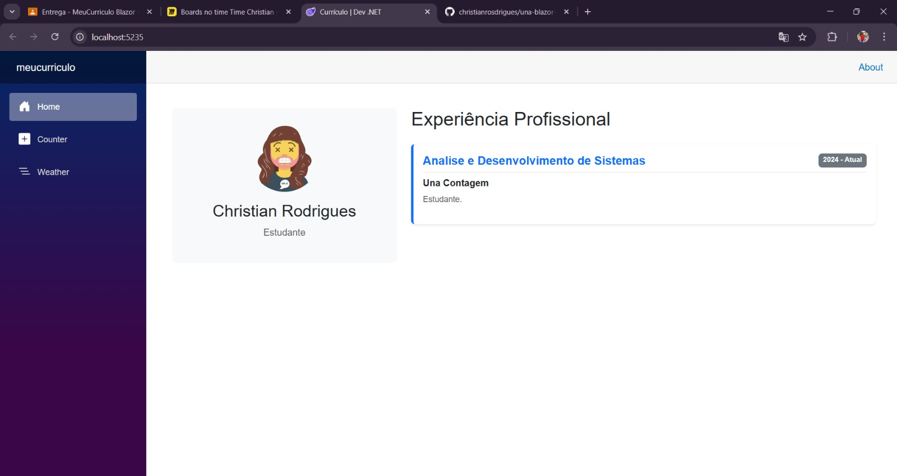

# Meu Currículo - Blazor

## Identificação

**Nome:** Christian Rodrigues Silva
**Curso:** Análise e Desenvolvimento de Sistemas
**Instituição:** Centro Universitário UNA

---

## Sobre o Projeto

Este projeto foi desenvolvido como parte da disciplina de **Interação Humano-Computador e UX**.

A aplicação consiste em um currículo profissional interativo criado com **Blazor**, com o objetivo de apresentar informações pessoais, acadêmicas e profissionais de forma clara, organizada e moderna.

O projeto foi personalizado para melhorar a experiência do usuário, com foco em:

* Layout mais profissional
* Navegação simples e intuitiva
* Organização eficiente das informações

## Guia de Execução

### Pré-requisitos

* .NET SDK 6.0 ou superior
* Visual Studio ou VS Code

### Como executar

1. Entre no terminal

2. Acesse a pasta do projeto

cd una-blazor-lista14

3. Entre na pasta da aplicação:

cd MeuCurriculo

4. Execute o projeto:

dotnet run

5. Abra no navegador:

https://localhost:5001

## Tecnologias Utilizadas

* C#
* .NET
* Blazor
* HTML5
* CSS3

## Screenshot da Aplicação

## Heurística - Ajuda e Documentação

A aplicação foi desenvolvida seguindo princípios de usabilidade, garantindo que o usuário consiga utilizar o sistema de forma intuitiva, sem necessidade de instruções complexas.

* Interface simples e objetiva
* Informações organizadas e de fácil acesso
* Navegação clara e eficiente
